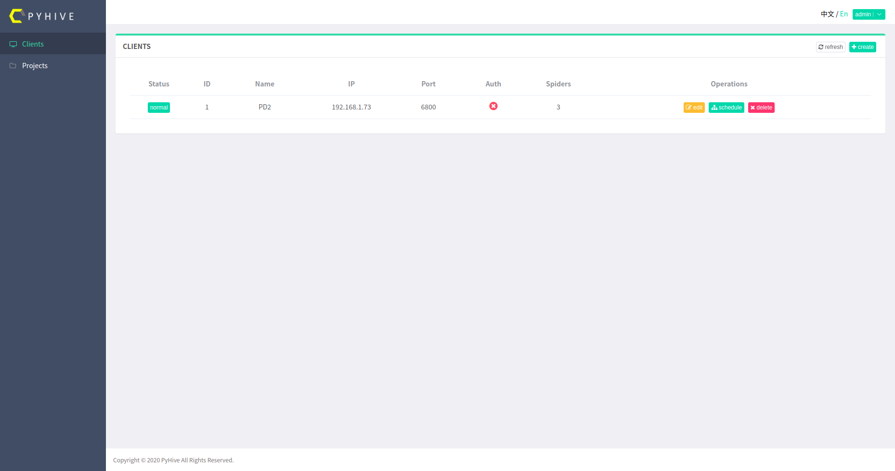
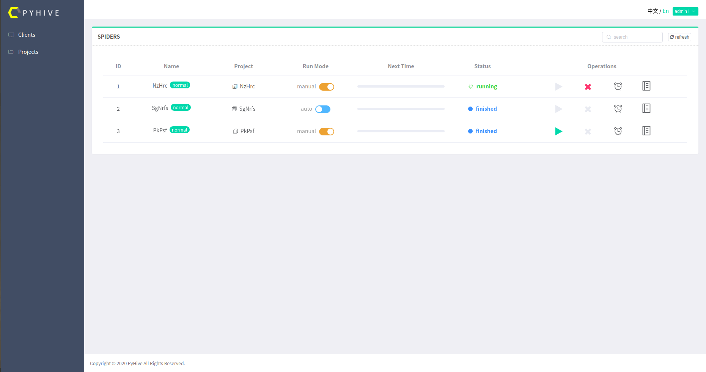
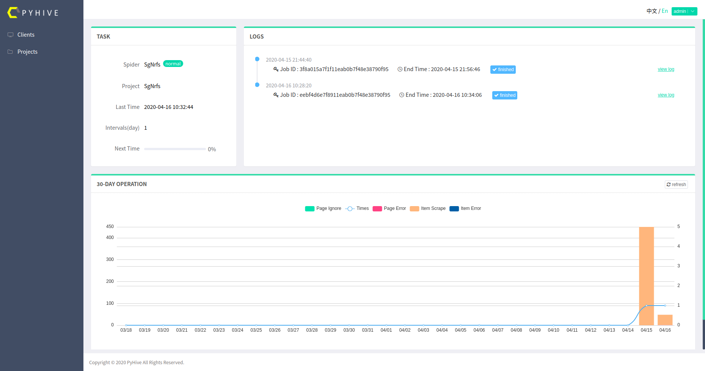
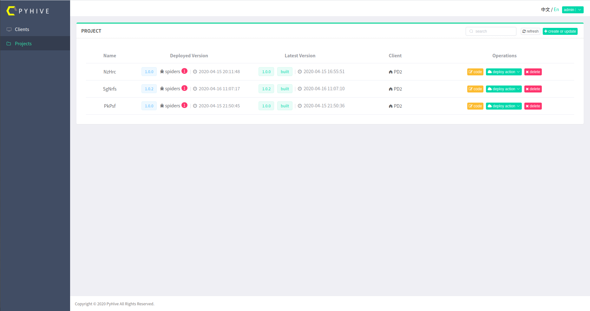

# PyHive

GUI Crawler Management Framework Based on [WorkerBee](https://github.com/Frank-ZYW/WorkerBee), Django and Vue.js

PyHive is modified based on another Github project [Gerapy](https://github.com/Gerapy/Gerapy) Thanks for the contributors' great effort


## Support

PyHive is developed based on Python 3.x


## Docker

**Highly recommended to deploy PyHive with docker.**

Run container:

```shell
docker run -d -p 8000:8000 -v ~/pyhive:/app/pyhive frankzyw/pyhive:latest
```

The server will run at [http://localhost:8000](http://localhost:8000). You can use the original account (user: admin, password: admin) to login. Suggest to change the password later for safety by visit [http://localhost:8000/admin](http://localhost:8000/admin).

Command Usage:

```shell
docker run -d -v <workspace>:/app/pyhive -p <public_port>:<container_port> frankzyw/pyhive:latest
```

Specify your workspace to mount PyHive workspace by `-v <workspace>:/app/pyhive` and specify server port by `-p <public_port>:<container_port>`.


## Install

Install PyHive by [wheel](https://github.com/Frank-ZYW/PyHive/releases):

```bash
pip install pyhive-1.4.1-py3-none-any.whl
```

Initialize the workspace:

```bash
pyhive init
```

You will get a folder named `pyhive`. Also you can specify the name of your workspace by command:

```bash
pyhive init <workspace>
```

Turn to root folder and initialize DB:

```bash
cd pyhive
pyhive migrate
```

Create a default superuser:

```shell
pyhive initadmin  # default account --> user:admin password:admin
```

Or you can create a designated account by execute:

```shell
pyhive createsuperuser
```

Run server:

```bash
pyhive runserver
```

Visit [http://localhost:8000](http://localhost:8000) to enjoy it. Also you can visit [http://localhost:8000/admin](http://localhost:8000/admin) to get the admin management backend.

If you want to run PyHive in public, suggest to use uwsgi:

```shell
uwsgi --ini uwsgi.ini
```

The server will run on [http://127.0.0.1:3031](http://127.0.0.1:3031). You can also modify the uwsgi configuration according to your needs.

If you want another high performance web server like Nginx to handle static files. Execute follow command to collect static files.

```shell
pyhive collectstatic
```


## Usage

### Client Manage

- add/update/delete client
- view the status of clients



### Spider

- spiders can run in Auto/Manual mode.

- set time to allow the spider run periodically & automatically.



### Monitor

- monitor the status of spiders, including data & logs for the past 30 days




### Project

- upload `.zip` file(WorkerBee project) can add/update project.

- `code` can view/modify source code online.

- `build` can build package online for deploy.
- `deploy` can deploy the project to client which you chose.
- `withdraw` can remove project from client(not PyHive).




## Communication

If you have any questions or ideas, you can send [Issues](https://github.com/Frank-ZYW/PyHive/issues) or [Pull Requests](https://github.com/Frank-ZYW/PyHive/pulls), your suggestions are really import for me, thanks for your contribution.